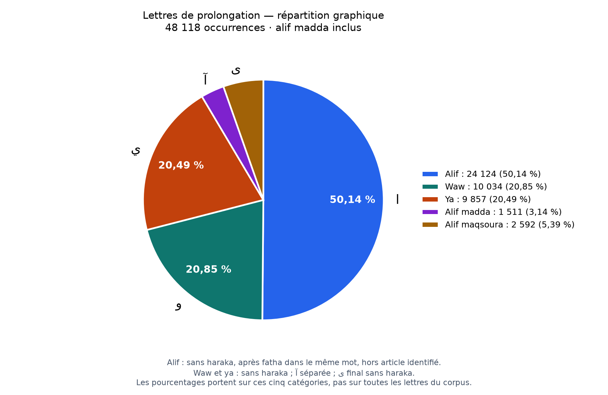
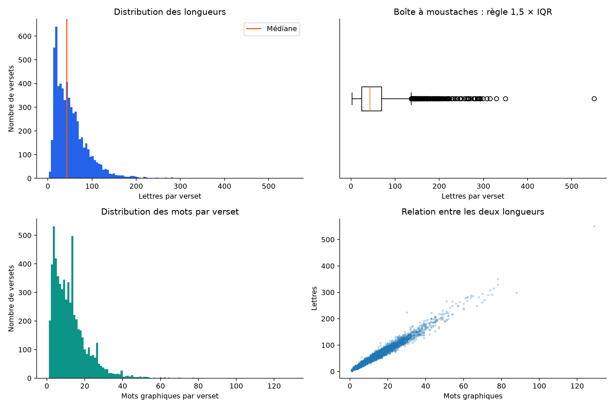
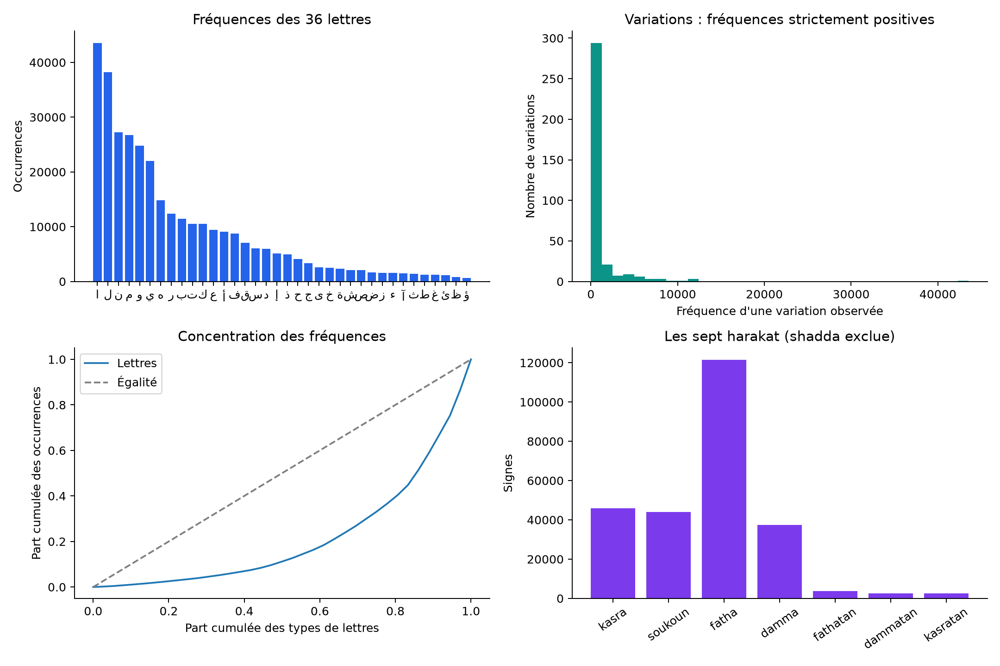
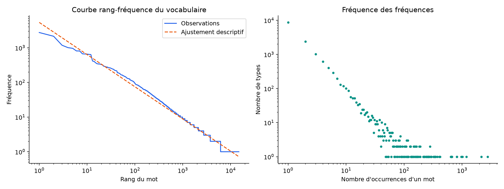
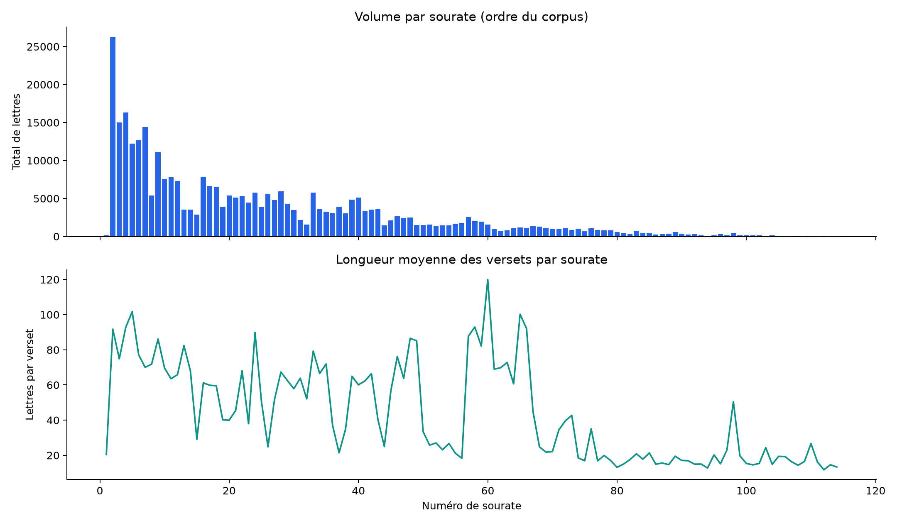

# Étude statistique du texte coranique — écriture arabe courante

Cette étude porte sur le texte coranique **écrit selon l'usage courant de la langue arabe**, tel qu'il figure dans le document Word fourni. Les résultats sont propres à ce corpus et à cette convention d'écriture.
Une **deuxième étude distincte selon la convention du rasm othmani (الرسم العثماني)** est envisagée par la suite. Elle n'est pas encore réalisée ; aucune comparaison avec cette convention n'est incluse dans les résultats actuels.

Base analysée : **6 236 versets  114 sourates  330 705 lettres et 77 794 mots graphiques**.
Le total de lettres est contrôlé contre les textes sans harakat et contre chaque ligne du CSV des variations.

## 1. Méthode et portée

Source de référence : `data/verses.csv`. Les tableaux détaillés sont régénérables avec la commande complète du README ; le manifeste conserve l’empreinte du corpus.
Les mots sont des suites de lettres arabes du texte sans harakat. Les préfixes attachés restent attachés ; aucune lemmatisation ni fusion de ا, أ, إ, آ, ة, ه, ى et ي. Ce sont des formes graphiques, pas des racines ni des lexèmes.
Les lettres et leurs signes sont analysés en NFC. La shadda ne double pas le nombre de lettres. Les numéros, parenthèses et espaces sont exclus. Les sourates sont reconstruites à partir des retours à (1), avec contrôle de toute la séquence des numéros.
Il s'agit de statistiques de la totalité du corpus fourni : écart type de population (ddof=0), quantiles à interpolation linéaire. Pas de tests de significativité ni d'hypothèse d'indépendance des versets. Les différences ne prouvent ni intention, ni causalité, ni singularité par rapport à d'autres corpus.

## 2. Longueur des versets et des mots

| Mesure | Lettres / verset | Mots / verset | Lettres / mot (occurrences) |
|---|---:|---:|---:|
| Minimum | 2,00 | 1,00 | 1,00 |
| Q1 | 24,00 | 6,00 | 3,00 |
| Médiane | 43,00 | 10,00 | 4,00 |
| Moyenne | 53,03 | 12,47 | 4,25 |
| Q3 | 69,00 | 16,00 | 5,00 |
| 95e percentile | 126,00 | 30,00 | 7,00 |
| Maximum | 551,00 | 129,00 | 11,00 |
| Écart type | 39,83 | 9,46 | 1,61 |
| Écart interquartile | 45,00 | 10,00 | 2,00 |
| Écart absolu médian (MAD) | 22,00 | 5,00 | 1,00 |
| Coefficient de variation | 0,75 | 0,76 | 0,38 |
| Asymétrie | 2,18 | 2,15 | 0,48 |
| Excès d'aplatissement | 9,63 | 9,53 | -0,33 |

La moyenne supérieure à la médiane et l'asymétrie positive indiquent une queue vers les versets longs.
Corrélation descriptive lettres/mots par verset : Pearson r = **0,99**. Ces mesures de taille sont liées par construction ; cette corrélation n'est pas une découverte indépendante.

## 3. Valeurs atypiques

Règle de Tukey : valeur hors [Q1 − 1,5 × IQR ; Q3 + 1,5 × IQR]. Valeur extrême : même règle avec 3 × IQR. Vérification robuste complémentaire : |0,67449 × (x − médiane) / MAD| > 3,5. Si MAD = 0, cette dernière mesure est indéfinie.

| Distribution | Borne basse | Borne haute | Atypiques Tukey | Extrêmes 3×IQR | Atypiques MAD |
|---|---:|---:|---:|---:|---:|
| verse_letters | -43,50 | 136,50 | 234 | 50 | 139 |
| verse_words | -9,00 | 31,00 | 254 | 58 | 171 |
| letter_frequency | -11 983,50 | 24 410,50 | 5 | 2 | 5 |
| variation_frequency_observed | -751,00 | 1 297,00 | 54 | 39 | 74 |
| word_frequency | -2,00 | 6,00 | 1431 | 988 | non défini (MAD = 0) |
| surah_letters | -4 747,38 | 8 945,62 | 7 | 4 | 7 |

Les seuils sont descriptifs : un verset long ou une lettre fréquente n'est pas une anomalie du texte. Les distributions discrètes et très asymétriques peuvent produire beaucoup de signalements. Les seuils négatifs n'identifient aucun cas inférieur pour des longueurs positives.

### Dix versets les plus longs

| Sourate:verset | Indice global | Lettres | Mots |
|---|---:|---:|---:|
| 2:282 | 289 | 551 | 129 |
| 24:31 | 2822 | 350 | 78 |
| 73:20 | 5495 | 329 | 78 |
| 24:61 | 2852 | 315 | 76 |
| 2:102 | 109 | 308 | 74 |
| 4:12 | 505 | 299 | 88 |
| 33:53 | 3586 | 294 | 70 |
| 3:154 | 447 | 291 | 75 |
| 2:196 | 203 | 290 | 73 |
| 2:233 | 240 | 288 | 64 |

Tous les versets, leur texte et leurs signalements figurent dans `verse_metrics.csv` ; les seuls signalements sont dans `verse_outliers.csv`.

## 4. Lettres, variations et harakat

Le corpus contient 36 lettres distinctes et 349 variations observées sur 576 colonnes. Les 227 colonnes nulles ne sont pas des formes rares attestées.
Les statistiques et seuils des variations observées excluent les zéros ; une distribution séparée `variation_frequency_all_columns` inclut toute la grille pour expliciter l'effet de ce choix.

| Lettre | Fréquence | Part des lettres |
|---|---:|---:|
| ا | 43540 | 13,17 % |
| ل | 38191 | 11,55 % |
| ن | 27269 | 8,25 % |
| م | 26735 | 8,08 % |
| و | 24813 | 7,50 % |
| ي | 21972 | 6,64 % |
| ه | 14850 | 4,49 % |
| ر | 12403 | 3,75 % |
| ب | 11491 | 3,47 % |
| ت | 10520 | 3,18 % |
| ك | 10497 | 3,17 % |
| ع | 9405 | 2,84 % |

Les dix lettres les plus fréquentes représentent **70,09 %** des lettres. Gini des fréquences : **0,56** (0 = égalité).
Entropie marginale des lettres : **4,39 bits/lettre**, maximum à effectif de types fixé : 5,17. Nombre effectif de types (2^H) : 20,92.
Cette entropie utilise seulement les fréquences marginales : elle ne mesure ni le sens, ni la prévisibilité contextuelle du texte.

| Signe | Occurrences | Part des sept harakat |
|---|---:|---:|
| fatha | 121438 | 47,12 % |
| damma | 37320 | 14,48 % |
| soukoun | 44114 | 17,12 % |
| kasra | 45970 | 17,84 % |
| dammatan | 2519 | 0,98 % |
| kasratan | 2633 | 1,02 % |
| fathatan | 3742 | 1,45 % |

Shadda : **18914** signes, comptés séparément des sept harakat.
Lettres avec au moins une des sept harakat : **257736** ; sans ces sept harakat : **72969**. Parmi ces dernières, 72969 sont sans signe et 0 portent uniquement une shadda.
Ces catégories ne signifient pas qu'une annotation manque : elles comprennent notamment les lettres de prolongation. Aucune correction linguistique n'est déduite de ces nombres.

### Lettres de prolongation : répartition graphique

Total retenu : **48 118 occurrences**  pour ا  و et ي selon les critères ci-dessous  avec آ et ى final sans haraka séparés.
Pour ا, la lettre précédente doit porter une **fatha** dans le même mot (éventuellement avec shadda). Le fathatan ne remplace pas la fatha dans ce filtre. **11958 alifs d'article sont exclus** dans ال initial ou dans وال, فال, بال ; **7458 autres alifs** sont exclus faute de fatha précédente.
Le filtre de l'article reste nécessaire : dans وَالْـ et فَالْـ, une fatha précède aussi l'alif. Cette règle graphique reste limitée aux préfixes cités ; elle n'est pas une analyse morphologique exhaustive. Le critère de و et ي reste l'absence de haraka, et آ est comptée séparément. Le total général reste 330 705 lettres.
L’alif maqsoura ى est retenu en fin de mot sans aucune des sept harakat sur cette lettre, sans condition sur les signes de la lettre précédente. Ainsi مُوسَى et هُدًى sont inclus : dans هُدًى, le fathatan porte sur د. Ce classement graphique ne distingue pas la pause de la liaison ; la shadda reste une dimension séparée.
Comparaison avant/après l’ajout de ى final sans haraka : 45 526 → 48 118 candidats (+2 592). Les quatre catégories précédentes et le total des lettres écrites restent inchangés.
Les pourcentages sont calculés sur ce total, et non sur les 330 705 lettres. Ce critère graphique ne constitue pas une identification phonétique de chaque prolongation.

| Lettre | Occurrences | Part du total retenu |
|---|---:|---:|
| ا | 24124 | 50,14 % |
| و | 10034 | 20,85 % |
| ي | 9857 | 20,49 % |
| آ | 1511 | 3,14 % |
| ى | 2592 | 5,39 % |

## 5. Diversité lexicale et répétition

**77794 occurrences de mots**, **14872 formes distinctes** sans harakat. TTR (types / occurrences) : **19,12 %**.
Hapax (formes présentes une seule fois) : **8711**, soit 58,57 % des types et 11,20 % des occurrences. Formes présentes deux fois : 2408.
MATTR : **0,66** pour une fenêtre de 500 mots et **0,58** pour 1 000 mots. Calcul exact sur toutes les fenêtres successives ; elles peuvent franchir une limite de verset ou de sourate.
Yule K : **38,96**, calculé par 10 000 × (Σf² − N) / N² ; il résume la répétition des formes. Concentration des dix mots les plus fréquents : **15,03 %**.
Le TTR diminue généralement avec la taille du texte ; il ne faut pas comparer directement les TTR de sourates très différentes en longueur. MATTR fixe la taille des fenêtres, mais reste sensible à la segmentation et à l'ordre du texte.

| Mot sans harakat | Fréquence | Part des mots |
|---|---:|---:|
| من | 2763 | 3,55 % |
| الله | 2153 | 2,77 % |
| في | 1185 | 1,52 % |
| ما | 1010 | 1,30 % |
| إن | 966 | 1,24 % |
| لا | 812 | 1,04 % |
| الذين | 810 | 1,04 % |
| على | 670 | 0,86 % |
| إلا | 664 | 0,85 % |
| ولا | 658 | 0,85 % |
| وما | 646 | 0,83 % |
| أن | 638 | 0,82 % |
| قال | 416 | 0,53 % |
| إلى | 405 | 0,52 % |
| لهم | 373 | 0,48 % |

Courbe rang-fréquence : pente log-log **-0,93**, R² **0,96**, ajustée sur tous les 14872 types. C'est un résumé descriptif, pas un test démontrant une loi de puissance ; les ex æquo et les hapax influencent la pente.
Répétitions exactes après suppression des harakat et des numéros : **98** textes de versets répétés, totalisant **280** occurrences. Il ne s'agit pas d'une détection de paraphrases.
`word_bigrams.csv` compte les paires de mots contigus à l'intérieur de chaque verset. `letter_bigrams.csv` compte les paires de lettres à l'intérieur de chaque mot. Aucune paire ne franchit les frontières indiquées ; ce sont des fréquences, pas des scores de collocation ni des liens sémantiques.

## 6. Comparaison des sourates

Les totaux mesurent surtout la taille de la sourate. La moyenne par verset permet une autre comparaison. `surah_metrics.csv` fournit aussi la médiane, la diversité brute et MATTR sur 100 mots (non défini si la sourate contient moins de 100 mots).

### Dix plus grandes longueurs moyennes de verset

| Sourate | Versets | Lettres | Lettres / verset | Mots / verset |
|---|---:|---:|---:|---:|
| 60 | 13 | 1560 | 120,00 | 27,08 |
| 5 | 120 | 12206 | 101,72 | 23,64 |
| 65 | 12 | 1203 | 100,25 | 24,08 |
| 58 | 22 | 2046 | 93,00 | 21,59 |
| 4 | 176 | 16332 | 92,80 | 21,38 |
| 66 | 12 | 1105 | 92,08 | 21,17 |
| 2 | 286 | 26249 | 91,78 | 21,47 |
| 24 | 64 | 5754 | 89,91 | 20,61 |
| 57 | 29 | 2545 | 87,76 | 19,83 |
| 48 | 29 | 2510 | 86,55 | 19,31 |

L'ordre des sourates sur le graphique est celui du corpus ; il n'est pas traité comme une chronologie.

## 7. Graphiques et fichiers

Chaque graphique est fourni en PNG et en PDF. Le classeur `statistical_tables.xlsx` regroupe les tableaux ; les CSV restent disponibles pour poursuivre les analyses.

